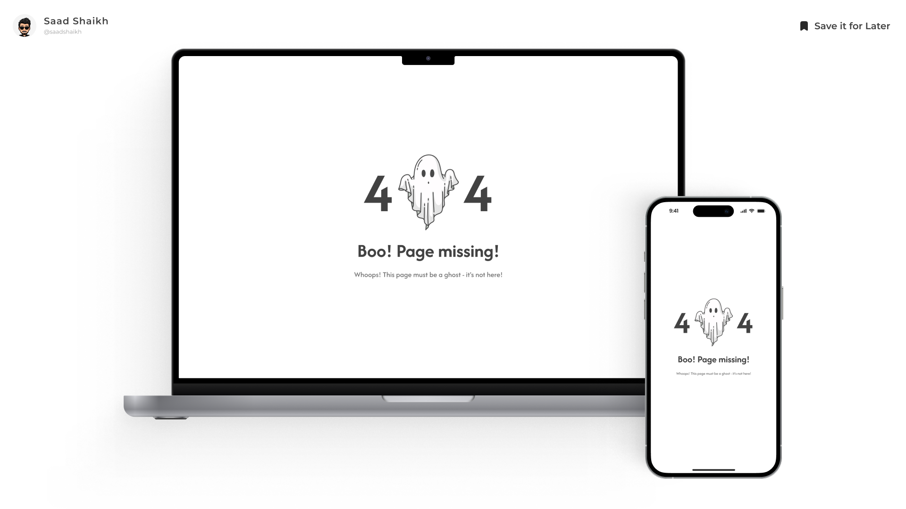

# 404-Page



## Overview

**404-Page** is a clean, modern, and responsive **404 error page** built using **React**, **Tailwind CSS**, and **JavaScript**. It's designed to improve user experience when navigating to broken or missing links on a website.

Perfect for web apps, portfolios, or any project that needs a stylish and user-friendly "Page Not Found" screen.

---

## Live Preview & Design

* **[Live Preview](https://boo-404.vercel.app/)**
  See the 404-Page in action.

* **[View Design on Figma](https://www.figma.com/community/file/1381562385964018425/08-daily-ui-challenge-404-page)**
  Check out the design prototype or duplicate for your own use.

---

## Features

* **Clean & Minimal UI**: Clearly communicates the 404 error with modern visuals.
* **Responsive Layout**: Looks great on both desktop and mobile devices.
* **Animated Elements**: Smooth transitions and effects using Tailwind and CSS animations.
* **Customizable**: Easy to edit text, styles, and layout to fit your brand or website.
* **Accessible Design**: Built with semantic HTML and accessibility in mind.

---

## Technologies Used

* **HTML**
* **CSS**
* **JavaScript**
* **React**
* **Tailwind CSS**

---

## Installation

To run this project locally:

1. **Clone the repository:**

   ```bash
   git clone https://github.com/saad-shaikh-256/404-Page.git
   ```

2. **Navigate to the project folder:**

   ```bash
   cd 404-page
   ```

3. **Install dependencies:**

   ```bash
   npm install
   ```

4. **Start the development server:**

   ```bash
   npm start
   ```

5. **Open [http://localhost:3000](http://localhost:3000) in your browser.**

---

## Usage Notes

* This is a **standalone 404 error page** and can be integrated into any web app or site.
* You can add it to your routing logic in frameworks like React Router to catch undefined routes.
* Easily replace the default image, error code, and message with your own content or brand tone.

---

## Future Enhancements

* Optional animation toggle
* Themed 404 pages (funny, minimal, illustrated, etc.)
* Redirect button with dynamic return logic

---

🚀 **Designed & Developed by [Saad Shaikh](https://saad-shaikh.vercel.app/)**

Feel free to suggest features, report bugs, or fork the project!